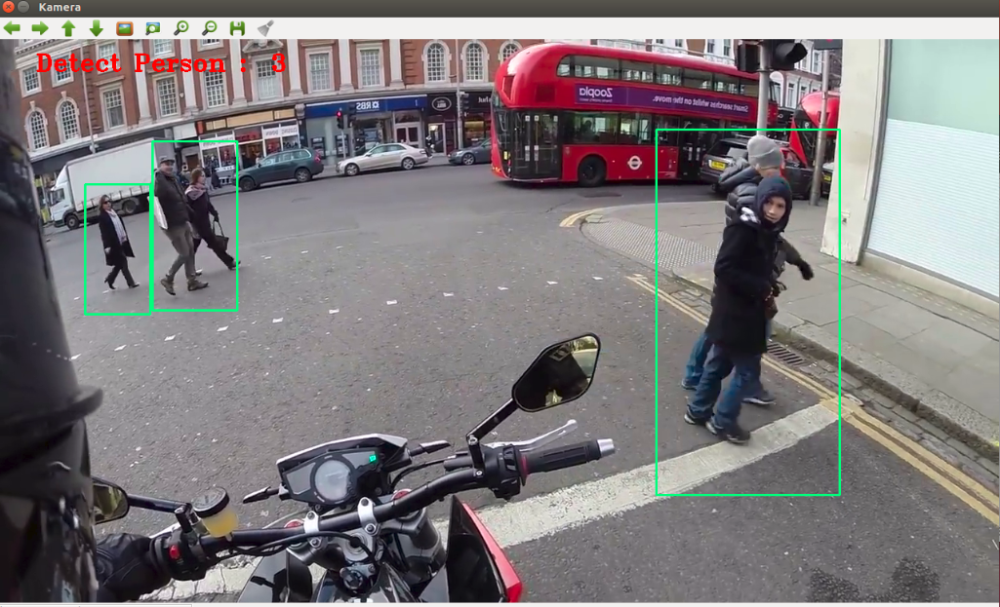
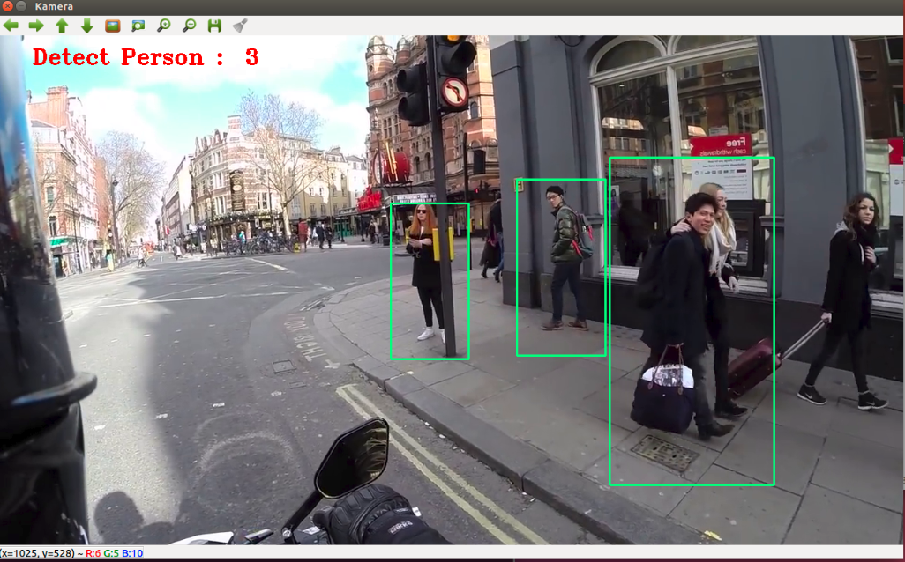

# Pedestrian Detection

This project counts the number of people detected on the image they have taken from the camera using the OpenCV library.

### Test

```sh
$ git clone https://github.com/onursezer/PedestrianDetection.git
$ cd PedestrianDetection
$ python detect.py
```


### == Demo ==



